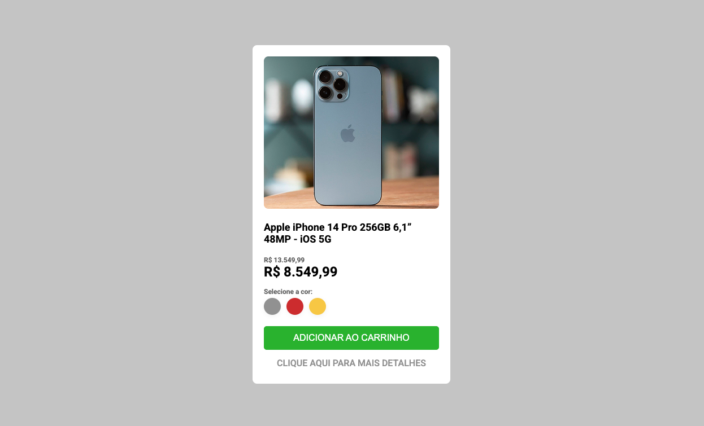

# 🧩 Shop Item Card Component

A customizable shop item card component designed for e-commerce websites. It showcases product images, titles, prices, and action buttons in a clean and responsive layout.

---

## 📸 Preview



---

## ✨ Features

- Responsive design for various screen sizes
- Customizable styles using CSS variables or utility classes

---

## 🧰 Tech Stack

- HTML5
- CSS3

---

## 🚀 Getting Started

### 📁 Folder Structure

```plaintext
shop-item-card/
├── index.html
├── style.css
├── script.js (optional)
└── README.md
```

## ⚙️ Customization

Change --color variables to match your brand

Add icons using <i> or <svg>

Use aria-label for accessibility

## 📚 Learning Notes

✅ This component was built to practice CSS, responsive spacing, and consistent design tokens.

## 📄 License

MIT License

## 📬 Contact

Fransuelton Francisco
📫 contato@fransuelton.dev
🐙 github.com/Fransuelton
💼 linkedin.com/in/fransuelton
